#  Quick Knowledge Guide: Camtasia 2

### Synopsis
Recording a Camtasia session is a quick way to generate re-usable training materials that can be shared with others. Sometimes these recordings need to be edited in order to upload them to a formal eLearning course. This document has been created to help keep the recording quality as high as possible for re-use. This guide will provide you the information needed to capture high quality screen recordings defined by your _Learning & Performance_ team.

### Objectives
By the end of this guide, you will have received information on:
* Installing the required software
* Configuring the initial settings
* Adjusting the recording dimensions
* Editing recorded videos

### How to Install the Software
The recommended software to record your desktop is Camtasia using Mac OS X. You can <a href="https://www.techsmith.com/download/oldversions" style="color:#0D6EE4">download a trial version</a> of Camtasia if you do not have a license.

### How to Set up Initial Recording Settings
Once you have Camtasia open, create a _New Project_, and click the record button on the bottom left side above the timeline.
 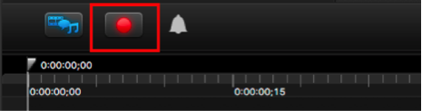

Ensure the room is quiet and there is minimal to no background noise. Use a headset and microphone, rather than your computer’s built-in mic. This will improve the audio quality. There are many reasonably priced headsets online, one recommendation is [Microsoft Lifechat LX-6000](https://www.amazon.com/Microsoft-LifeChat-LX-6000-for-Business/dp/B00465UNYI/ref=sr_1_1?ie=UTF8&qid=1501683539&sr=8-1&keywords=Microsoft+Lifechat+LX-6000).
 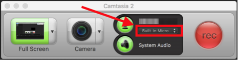

Do a sound check before any new session. Speak with a normal tone. The mic input bar should indicate 50% - 75% when speaking.
 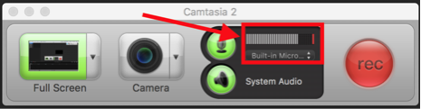

If the level is lower than 50% - 75%. Adjust your mic. This has to be done on your Mac’s system settings. Click the Apple Icon  in the top left corner of your Mac.
  

Select System Preferences.
 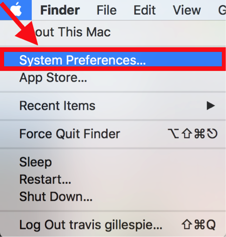

Click the Sound icon.
 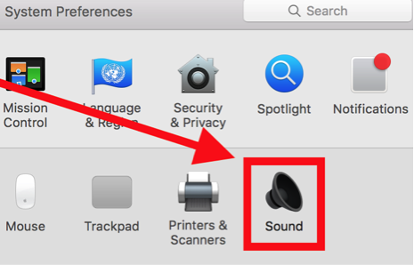

Click Input.
 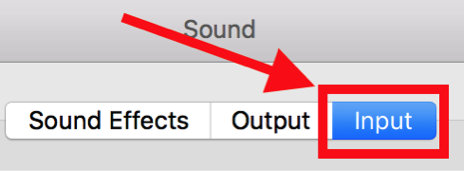

Select the device of the mic you are adjusting.
 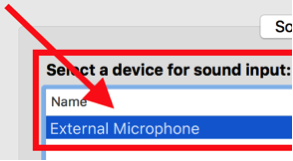

Slide the slider to adjust the input volume and do another sound check.
 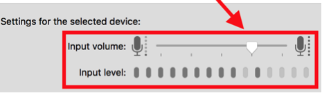

Adjust the input volume until the mic input bar indicates 50% - 75% when speaking.
 

Click the drop-down arrow to adjust the recording size.  Select Custom Region.
 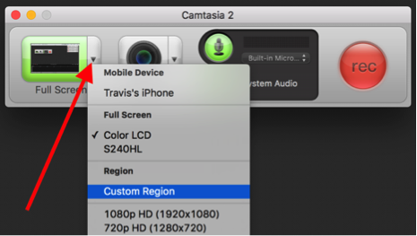

Click the red button to select the recording region.
 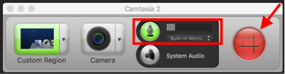

### USE LAPTOP AND NOT EXTERNAL MONITOR.
Quality over quantity: Unless your external monitor has retina display the tradeoff of screen real-estate (quantity) over laptop resolution (quality) isn’t worth it.
 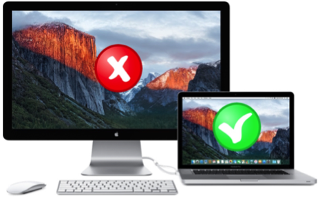

Click anywhere in the top left corner of your screen and drag your mouse to the bottom right corner. Try to cover as much of the screen you want to capture. Notice the a green dotted line will highlight the recording area.
 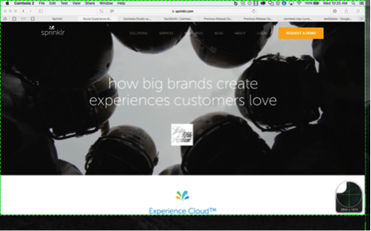

Focus on the content you want to record when selecting a region.

* Avoid selecting the region in yellow (browser menu and tabs).

* Avoid selecting the region in red to avoid recording your desktop’s Dock.
 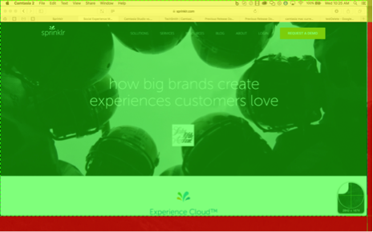

### How to Adjust Canvas Size Dimensions
The required dimensions for all course recordings are 1280 x 720. Manually enter these values into the provided textfields. Camtasia will remember these values for your next recording.
 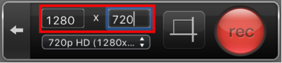

Place your mouse inside of the recording area (green dotted region). Then click down and drag the recording area to the web browser.
 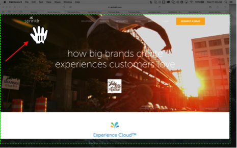

Click the record button  to begin recording.
 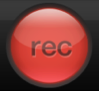

To Pause, Stop Recording and Start Over, click the red film icon  on the top menu bar.
 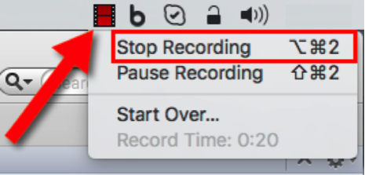

If you make an error while recording or need a section of video edited. Navigate to _Edit_, hover over _Marker_, and select _Add Markers_. Alternatively, select the _option_ + _M_ keys on your keyboard as a shortcut.
 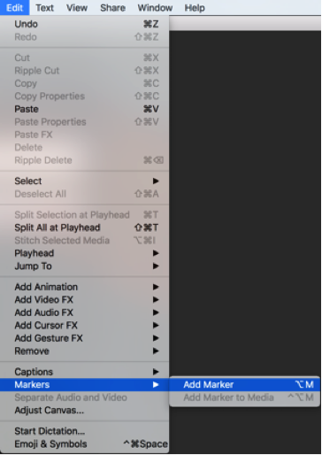

Drag the marker to the exact location that needs to be edited and enter an appropriate name for each marker (e.g. _Intro_, _Voice Over_, _Background Noise_, etc.). Markers can also be used to highlight sections for review. For example, one marker labeled _Begin_ can be placed at the start of a section, and a second marker labeled _End_ placed at the cutoff point.
 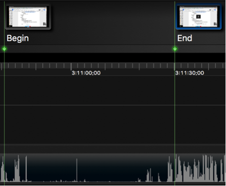

### How to Edit Both Video & Audio
For your convenience, there is a <a href="https://www.techsmith.com/tutorial-camtasia-mac-gs-3-editing-essentials-explore-editor.html" style="color:#0D6EE4">3 minute tutorial</a> on how to effectively edit video + audio from the play head. The tutorial covers:
* (0:46) A brief tour of the main parts of the Editor
* (1:27) Adding media to the media bin and other tips about the left pane
* (2:44) Resizing, moving, and rotating media on the canvas
* (3:26) Understanding the timeline

### How to Save Camtasia File
The _Learning & Performance_ team requests that you save and upload the Camtasia file, rather than exporting the video. To save a project, navigate to _File_ and select _Save As_.
 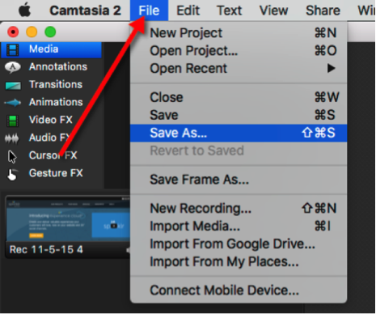

The filename should include the course name. You will need to upload the course once complete. Navigate to the _Learning & Performance_ <a href="https://drive.google.com/open?id=0B5w_Rm6Jrg-PSHNIcXFQSmluMDQ" style="color:#0D6EE4"> team drive folder</a>, and drop your files into the folder.
