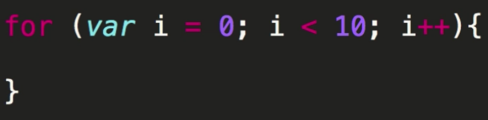
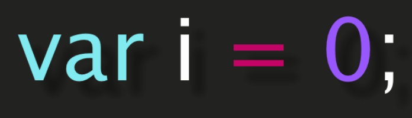
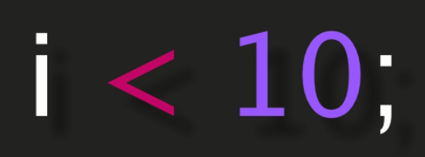

## For Loops
This tutorial will cover the basics of a JavaScript _for loop_.


</br></br>

```JavaScript
for (var i = 0; i < 10; i++){

}
```


### Objectives
By the end of this training you will understand:
* The basic components of a for loop
* How to create a for loop
* How to ace an interview question using a for loop

### Basic Components of a for loop.
A for loop is composed of three parts. Each of these parts has it's own function:

1. Sets the index

 * e.g. 


</br></br>


```JavaScript
var i = 0;
```


2. Checks the condition

 * e.g. 
</br></br>

```JavaScript
i < 10;
```
3. Increments the index

 * e.g. 
</br></br>

### How to create a for loop.


### How to ace an interview question using a for loop.
- - - -

```JavaScript
function test() {
 console.log("look ma’, no spaces");
}
```
*****
