<h1>This lesson is currently being built. It will be complete by EOD 9-21-17.</h1>  

## Soldering and Basic Electronics Safety

### Synopsis
In this training you will learn the basics of soldering. Soon, you will understand how solder has been used to piece together many of the electronic devices people have enjoyed for decades. Although many handheld electronics used today are assembled by machines, people still practice the manual process of soldering for a variety of electronic applications. Keep in mind this is only an overview. You can follow along to gain basic soldering skills, but it won't make you an expert.

### Prerequisites
A basic understanding of electronics is useful but not required.

### Objectives
By the end of this lesson you will be able to:
* Select proper soldering resources (i.e. tools and solder)
* Assemble your workstation
* Describe soldering best practices for electronics
* Experiment by soldering wires and other components together

### Required Tools
* Solder Station + Iron
* Wet Sponge or Cleaning Wire
* Wire Stripper (designed for 22-gauge wire)
* Solder
* Wire 22AWG
* Heat Shrink Tubing 3/32"
* Heat Gun
* Circuit Board
* Helping Hand

<!--
* Heat Shrink Wire Wrap
* Capacitors: 0.1 uF (2), 0.01uF (2)
* Resistors: 600 Ohm (3), 1 Meg Ohm (3), 120 K Ohm (3)
* Circuit Board
* 9v Battery and Clip
* 1 x Light Emitting Diode
-->

### General Safety
* Safety glasses are optional. Eye protection is a good idea when working with anything that might get into your eyes (e.g. chemicals, metal shards, or sawdust).
* Always assume the soldering iron is __HOT__. The tip can get very hot, and won’t glow orange as an indicator. You can easily burn yourself if not careful.
* Never leave a soldering iron unattended when plugged in (i.e. not only when it's turned on, but connected to a power source).
* Use a fire resistant surface when soldering.

### What is Soldering?
Soldering is the process of connecting two or more components (usually metal) by melting a metal alloy, called solder, over the joined pieces. The molten solder coats the components, cools, then hardens. It’s similar to working with glue.
 
<!--  -->

### Setting Up Your Workstation
<!-- fire resistant surface  -->
* Fire resistant surface:
  * Start with a fire resistant surface. If you can't obtain a table top that's fire resistant, invest in a silicone soldering mat that has a high tolerance to heat.

     

<!-- soldering iron  -->
* Soldering iron:
  * Soldering irons vary in price, ranging from $10 up to $1000. A low-power 15W - 30W iron is a good tool to start with. These irons are essential to working with smaller components that are vulnerable to excessive heat. Additionally, the smaller the iron, the easier it is to handle. The iron tip should taper like a sharpened pencil when working with small parts. But, delicate precision isn't needed for general purposes, so a chisel-shaped tip is recommended, because it transfers heat better.

    <!--   -->

     
<!-- sponge or cleaning wire  -->
* Tip cleaner:
  * Iron tips get dirty over time. The most popular methods of cleaning the tip involve a brass wire brush or wet sponge. Using a wire brush vs a wet sponge boils down to personal preference. However, the moisture from a wet sponge can cause the tip to crack due to thermal expansion and contraction. The bottom line is both options work.
  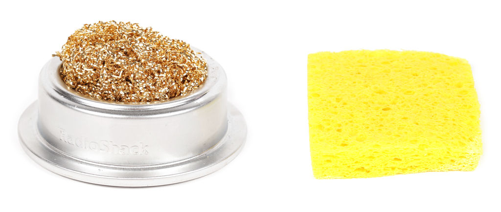 

<!-- wire  -->
* Wire:
  * Regarding electronics, wire is typically referred to as _hookup wire_. There are two types of hookup wire, _solid_ and _stranded_. Either type can be used for this project, but _stranded_ wire is recommended. Both wires look different on the inside when the insulator is stripped away.

  * _Solid_ wire houses a single conductor inside the surrounding plastic. This wire is ideal for projects that involve a breadboard.
    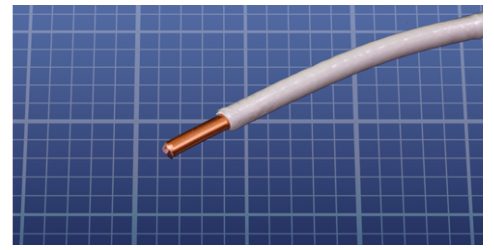 

  * _Stranded_ wire has multiple wires woven together. This makes it an ideal candidate when applying a coat of solder, because the alloy will fill the grooves to produce a reliable passageway for electric current.
    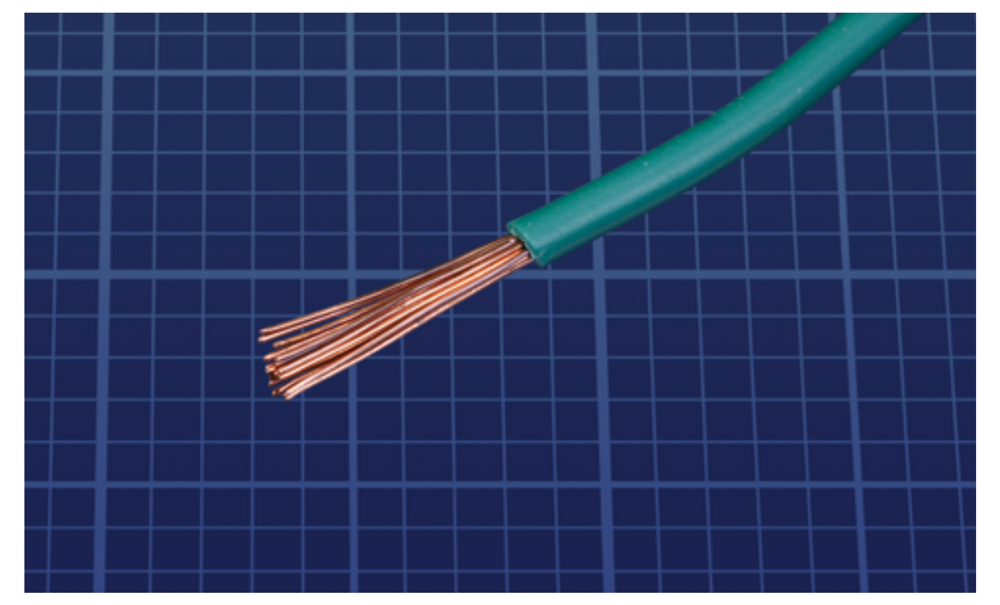 

<!-- solder type  -->
* Solder type
  * Solder is the material that's used to join components together. It comes in a variety of sizes, and chemical makeups. It’s important to have the right size and type of solder for electronics.
  * A diameter of 0.02” to 0.04” (0.5mm to 1mm) will be sufficient for this project.
  * Solder that is suitable for electronics projects should have word _electronics_ within the manufacturer's description.
  * Avoid buying solder made for plumbers or craft projects (e.g. jewlery). All solder contains a substance called _flux_. Plumbing solder's flux has a corrosive acid-base, while electrical solder has a rosin-core base. The acid flux requires more heat, and the rosin-core melts instantly in the heat provided by the soldering iron.
  * Some electrical solder contains lead. This solder flows smoothly when melted, it's easy to work with, but it poses health risks. Lead-free solder also has problems which make it harder to work with. The additional rosin creates more fumes, it melts at a higher temperature, and clumps together when cooling, but it isn't toxic.
  * Although lead-free solder is recommended, the final choice is subjective.
    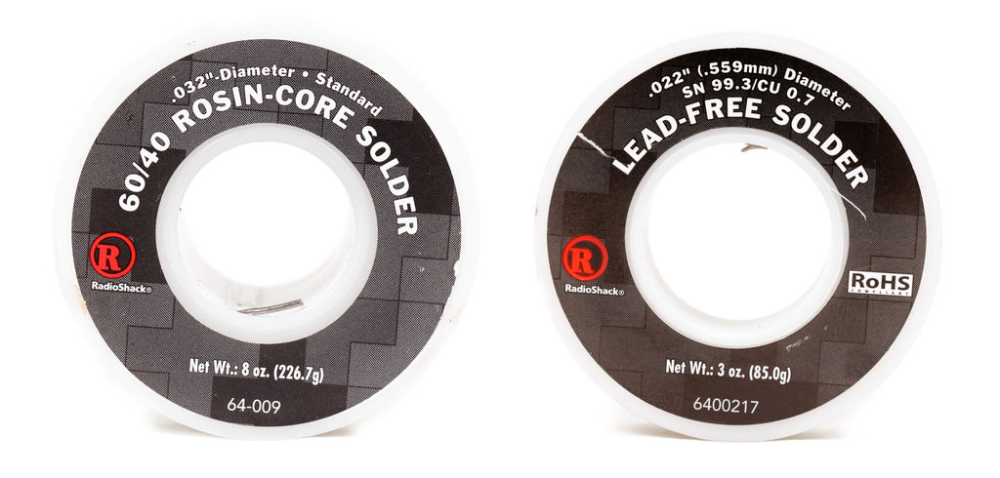 

<!-- helping hands  -->
* Helping hands:
  * The _Helping Hand_ (sometimes known as a _third hand_) uses alligator clips to hold competents while you apply solder.
    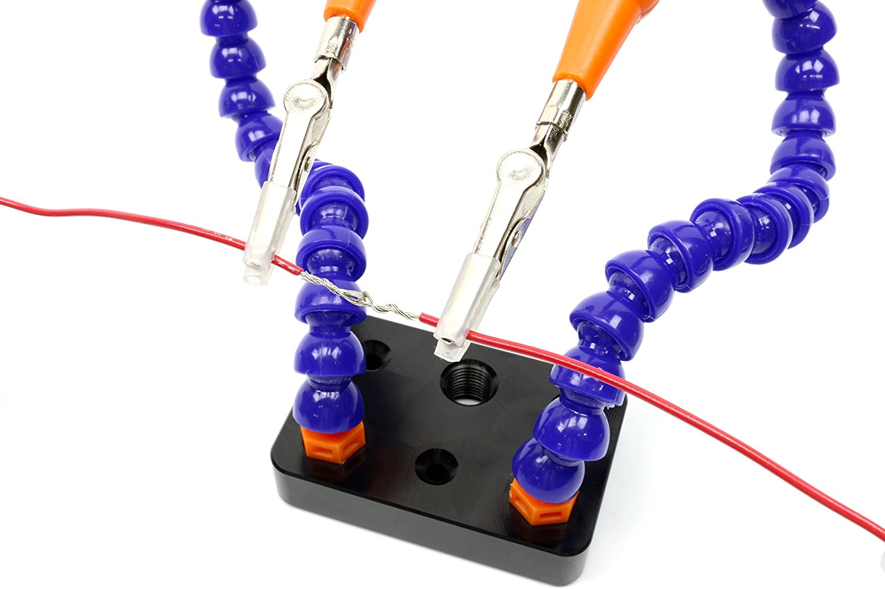 

<!-- lighting  -->
* Lighting:
  * Depending on the ambient light and your vision, consider a desk light. Electronic devices can be small, additional light can help you see and work with the components.
    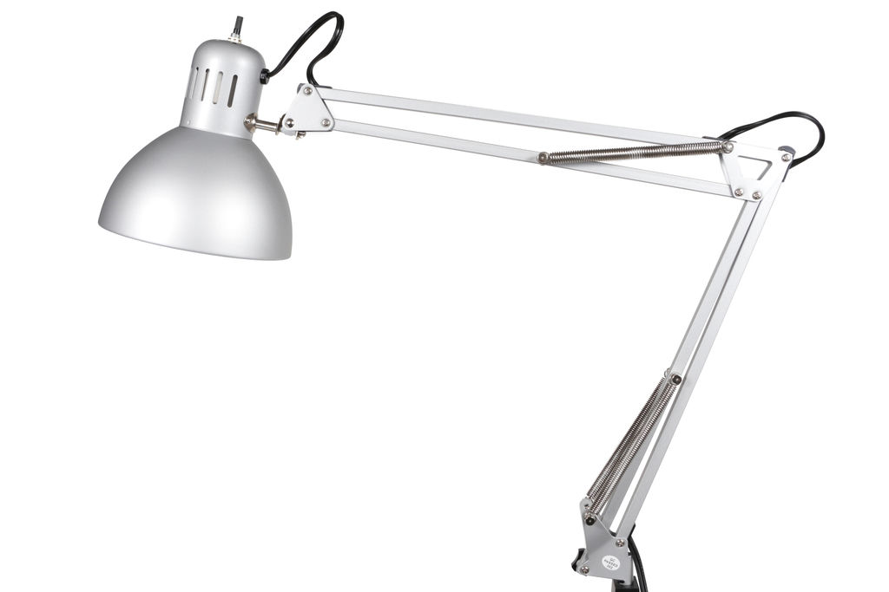 

<!-- fan  -->
* Fan:
  * Breathing soldering fumes can be hazerdous. Have a ventilation system in place. Even a small fan can help minimize your exposure.
    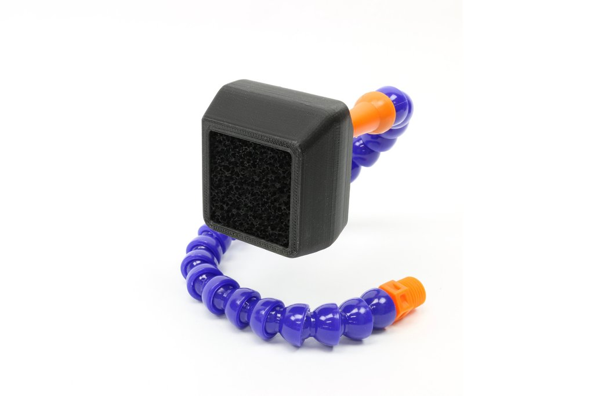 

### How to Hold the Soldering iron
* Holding a soldering iron is similar to a pencil. Except, hold the solderin iron further back by the insulated handle, rather than the tip.
    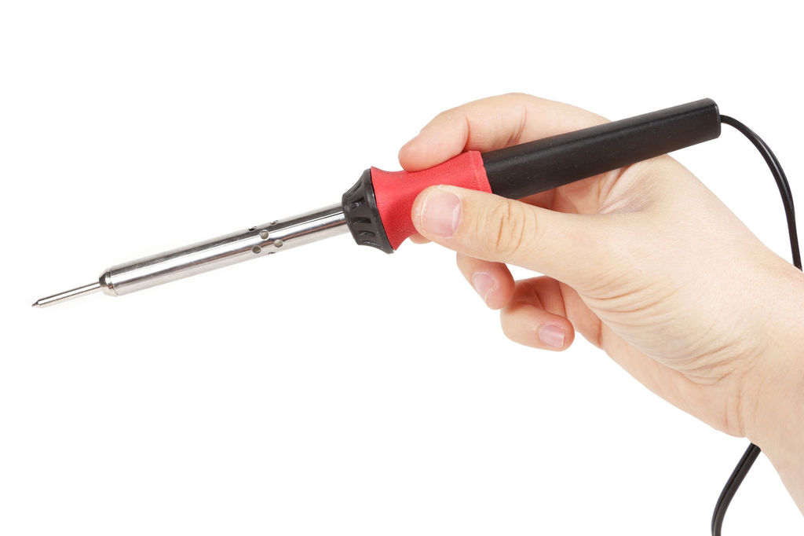 

* Remember the tip is hot, and will burn skin. Don't tough the metal part of the iron when turned on.
  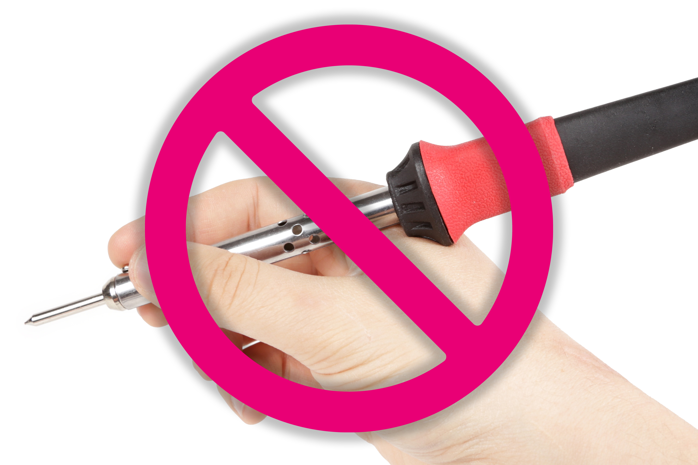 

* Even if the table or mat is heat resistant, don't rest the iron on its workstation surface. It will burn the surface, and can lead to a fire.
  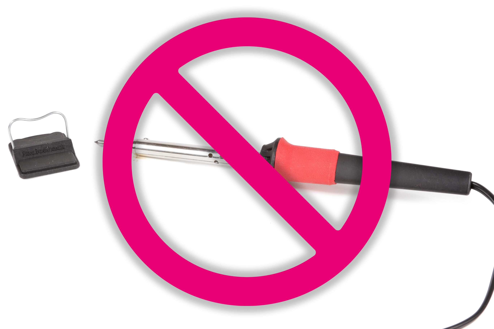 
<!-- Never leave soldering iron resting on the table. It will burn your work surface and could potentially start a fire. -->

### Tinning
Tinning is a technique used to help melt the connector contacts (i.e. wires) together. Tinning is simply the process of melting a coat of solder on the tip of your iron, and electronic components. This additional coat not only makes the soldering process easier, it fills gaps within the wires, and creates sturdy connections.

<!-- Turn on the soldering iron and wait for it to heat up. If you splurged on an adjustable temperature model, you can dial yours in to about 650 degrees.

Once it is heated up, you will want to tin the tip before using it for the first time.

All this involves is thoroughly melting solder all over the tip of the iron. This makes sure the tip has a nice solder coating, which will make it easier to melt solder the next time you use it. -->

<!--Here is a video that describes the tinning process.-->
<!-- VIDEO -->

### Cleaning the Soldering Iron Tip

<!-- Every time you melt solder using the tip, you will want to clean it off.
To do this, simply drag the tip 2 or 3 times across the cleaning pad. -->

### How to Solder Wire
The finished product should look something like this:
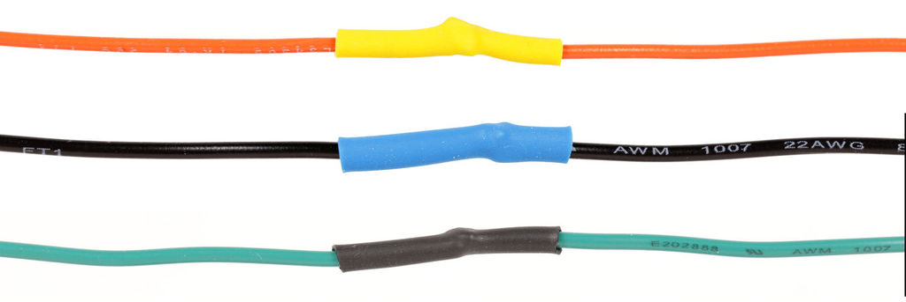 

* First grab two _stranded_ wires. Using a wire stripper, strip the insulation from one end on each wire.
  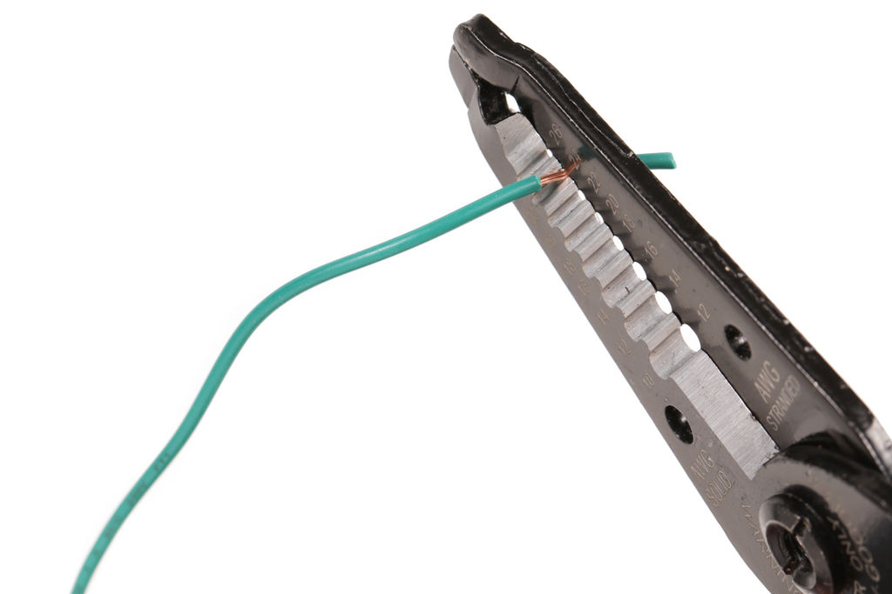 

* Slide a 1" piece of shrink tube onto one of the wires, then twist the two wires together.
  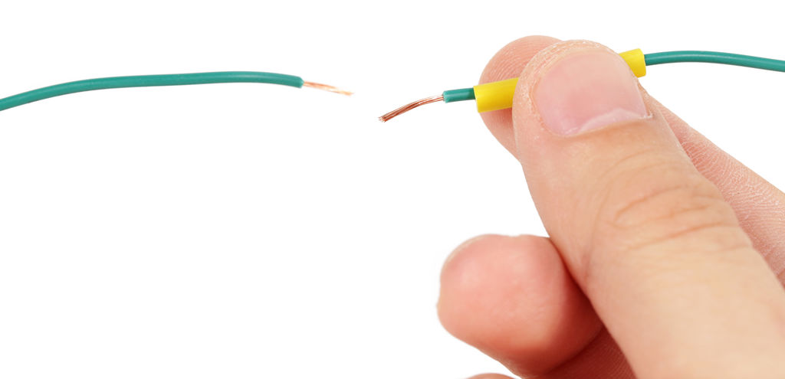 

### How to Solder Through Hole Components

### Clean Up & Maintenance
* Before leaving your station, make sure the area is clean, and iron is turned off. The safest measure is to unplug the soldering iron.
* Wash your hands with soap and water. Some solder contains lead and it can be ingested by mistake if its residue remains on your hands or under your fingernails. This is dangerous. Lead doesn't leave the body naturally, and even small exposures over time can cause lead poisoning.
