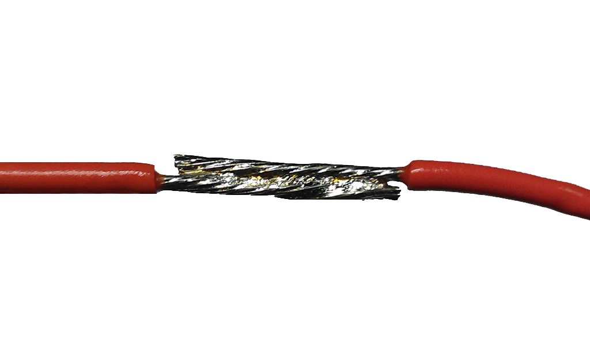
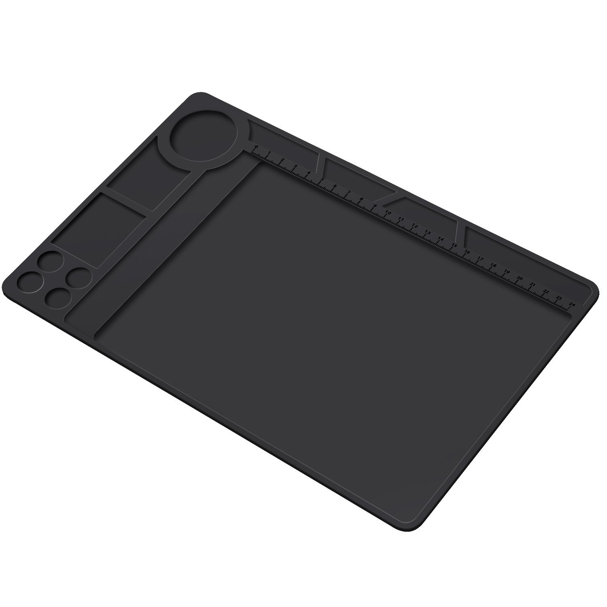
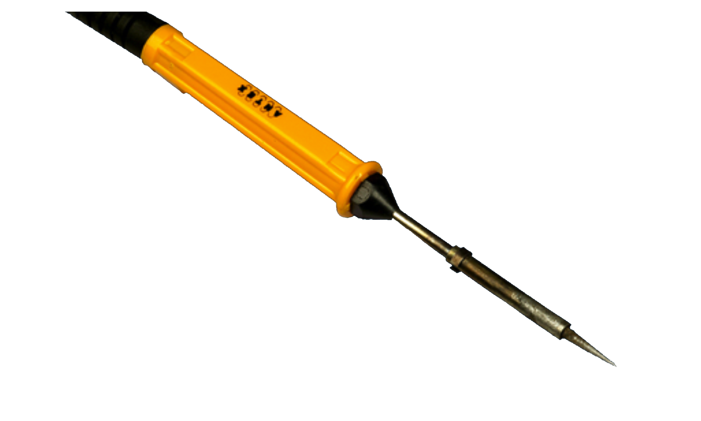
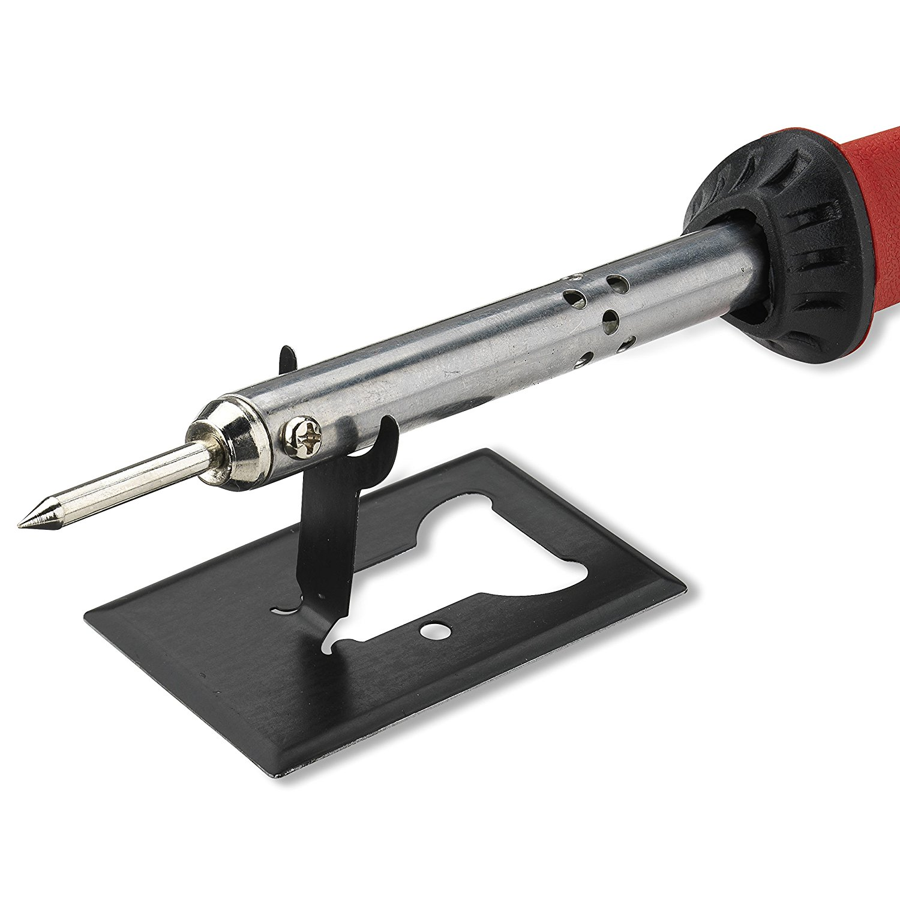

<h1>This lesson is currently being built. It will be complete by EOD 9-18-17.</h1>  

## Soldering and Basic Electronics Safety

### Synopsis
In this training you will learn the basics of soldering. Soon, you will understand how solder has been used to piece together many of the electronic devices people have enjoyed for decades. Although many handheld electronics used today are assembled by machines, people still practice the manual process of soldering for a variety of electronic applications. Keep in mind this is only an overview. You can follow along to gain basic soldering skills, but it won't make you an expert.

### Prerequisites
A basic understanding of electronics is useful but not required.

### Objectives
By the end of this lesson you will be able to:
* Select proper soldering resources (i.e. tools and solder)
* Assemble your workstation
* Describe soldering best practices for electronics
* Experiment by soldering wires and other components together

### Required Tools
* Solder Station + Iron
* Wet Sponge or Cleaning Wire
* Wire Stripper
* Solder
* Wire 22AWG
* Heat Shrink Tubing 3/32"
* Heat Gun
* Circuit Board
* Helping Hand

<!--
* Heat Shrink Wire Wrap
* Capacitors: 0.1 uF (2), 0.01uF (2)
* Resistors: 600 Ohm (3), 1 Meg Ohm (3), 120 K Ohm (3)
* Circuit Board
* 9v Battery and Clip
* 1 x Light Emitting Diode
-->

### General Safety
* Safety glasses are optional. Eye protection is a good idea when working with anything that might get into your eyes (e.g. chemicals, metal shards, or sawdust).
* Always assume the soldering iron is __HOT__. The tip can get very hot, and won’t glow orange as an indicator. You can easily burn yourself if not careful.
* Never leave a soldering iron unattended when plugged in (i.e. not only when it's turned on, but connected to a power source).
* Use a fire resistant surface when soldering.

### What is Soldering?
Soldering is the process of connecting two or more components (usually metal) by melting a metal alloy, called solder, over the joined pieces. The molten solder coats the components, cools, then hardens. It’s similar to working with glue.
 
<!--  -->

### Setting Up Your Workstation
<!-- fire resistant surface  -->
* Fire resistant surface:
  * Start with a fire resistant surface. If you can't obtain a table top that's fire resistant, invest in a silicone soldering mat that has a high tolerance to heat.

     

<!-- soldering iron  -->
* Soldering iron:
  * Soldering irons vary in price, ranging from $10 up to $1000. A low-power 15W - 30W iron is a good tool to start with. These irons are essential to working with smaller components that are vulnerable to excessive heat. Additionally, the smaller the iron, the easier it is to handle. The iron tip should taper like a sharpened pencil when working with small parts. But, delicate precision isn't needed for general purposes, so a chisel-shaped tip is recommended, because it transfers heat better.

    <!--   -->

     
<!-- sponge or cleaning wire  -->
* Tip clearner:
  * ...
<!-- wire  -->
* Wire:
  * ...
<!-- solder type  -->
* Solder type
  * ...
  <!-- * It’s important to have the right type of solder. Solder comes in a variety of sizes, and chemical makeup. -->
<!-- Let's talk about different types fo solder, and which types you should consider, or avoid -->

<!--Size matters, when it comes to solder. The thickness of the wire and electrical components will determine the thickness of solder needed. But, one good rule of thumb is to use thin solder when working with small components; somewhere in the range of 0.02” to 0.04” (0.5mm to 1mm) in diameter. -->

<!--When first getting started practice joining joints paper clips / wires… -->
<!-- links to demo videos -->

<!-- helping hands  -->
* Helping hands:
  * ...
<!-- lighting  -->
* Lighting:
  * ...
<!-- fan  -->
* Fan:
  * ...

### How to Hold the Soldering iron

### Tinning
Tinning is a technique used to help melt the connector contacts (i.e. wires) together. Tinning is simply the process of melting a coat of solder on the tip of your iron, and electronic components. This additional coat not only makes the soldering process easier, it fills gaps within the wires, and creates sturdy connections.

<!--Here is a video that describes the tinning process.-->
<!-- VIDEO -->

### Cleaning the Soldering Iron Tip

### How to Solder Wire

### How to Solder Through Hole Components

### Clean Up & Maintenance
* Before leaving your station, make sure the area is clean, and iron is turned off. The safest measure is to unplug the soldering iron.
* Wash your hands with soap and water. Some solder contains lead and it can be ingested by mistake if its residue remains on your hands or under your fingernails. This is dangerous. Lead doesn't leave the body naturally, and even small exposures over time can cause lead poisoning.
