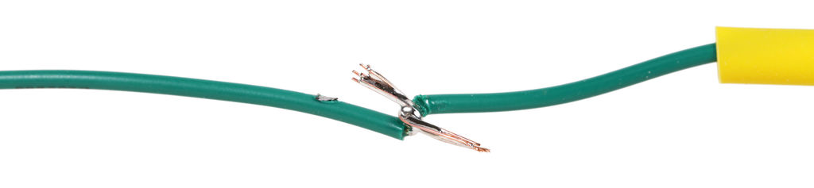

## Soldering and Basic Electronics Safety

### Synopsis
In this training you will learn the basics of soldering. Although many handheld electronics used today are assembled by machines, people still practice the manual process of soldering for a variety of electronic applications. Keep in mind this is only an overview.

### Prerequisites
A basic understanding of electronics is useful but not required.

### Objectives
By the end of this lesson you will be able to:
* Select proper soldering resources (i.e. tools and solder)
* Assemble your workstation
* Describe soldering best practices for electronics
* Experiment by soldering wires and other components together

### Required Tools
* Solder Station + Iron
* Wet Sponge or Cleaning Wire
* Wire Stripper (designed for 22-gauge wire)
* Solder
* Wire 22AWG
* Heat Shrink Tubing 3/32"
* Heat Gun
* Circuit Board
* Helping Hand

### General Safety
* Always assume the soldering iron is __HOT__. The tip can get very hot, and won’t glow orange as an indicator. You can easily burn yourself if not careful.
* Never leave a soldering iron unattended when plugged in (i.e. not only when it's turned on, but connected to a power source).
* Use a fire resistant surface when soldering.

### What is Soldering?
Soldering is the process of connecting two or more components (usually metal) by melting a metal alloy, called solder, over the joined pieces. The molten solder coats the components, cools, then hardens. It’s similar to working with glue.
 
<!--  -->

### Setting Up Your Workstation
<!-- fire resistant surface  -->
* Fire resistant surface:
  * Start with a fire resistant surface. If you can't obtain a table top that's fire resistant, invest in a silicone soldering mat that has a high tolerance to heat.

     

<!-- soldering iron  -->
* Soldering iron:
  * Soldering irons vary in price. A low-power 15W - 30W iron is a good tool to start with. These irons are not only essential to working with smaller components, they’re easier to handle. When working with small parts, the tip should taper like a sharpened pencil. But, delicate precision isn't needed for general purposes, so a chisel-shaped tip is recommended because it transfers heat better.
     

<!-- sponge or cleaning wire  -->
* Tip cleaner:
  * Iron tips get dirty over time, but they can be cleaned with a brass wire brush or wet sponge. The moisture from a wet sponge can cause the tip to crack due to thermal expansion and contraction. However, using a wire brush or wet sponge boils down to personal preference.
   

<!-- wire  -->
* Wire:
  * Electronics, wire is typically referred to as _hookup wire_. There are two types of hookup wire, _solid_ and _stranded_. _Stranded_ wire is recommended, but either type can be used for this project.

  * _Solid_ wire houses a single conductor inside the surrounding plastic. This wire is ideal for projects that involve a breadboard.
     

  * _Stranded_ wire has multiple wires woven together, which helps the solder alloy produce a reliable passageway for electric current.
     

<!-- solder type  -->
* Solder type
  * Solder is the material used to join components together. It’s important to have the right size and type of solder for electronics.
  * A diameter of 0.02” to 0.04” (0.5mm to 1mm) will be sufficient.
  * Solder that is suitable for electronics should have the word electronics written in the manufacturer's description.
  * Avoid buying solder made for plumbers or craft projects. All solder contains a substance called _flux_. Plumbing solder flux has a corrosive acid-base, while electrical solder has a rosin-core base. The acid flux requires more heat, but the rosin-core melts instantly.
  * Some solder contains lead. This solder flows smoothly when melted, it's easy to work with, but it poses health risks. Lead-free solder is safer, but it’s harder to work with.
  * Lead-free solder is recommended.
     

<!-- helping hands  -->
* Helping hands:
  * The _Helping Hand_ (sometimes known as a _third hand_) uses alligator clips to hold components together.
     

<!-- lighting  -->
* Lighting:
  * Consider using a desk light to illuminate small components.
     

<!-- fan  -->
* Fan:
  * Breathing soldering fumes can be hazardous. Even a small fan can help minimize your exposure.
     

### How to Hold the Soldering iron
* Hold the soldering iron by its insulated handle, rather than the tip.
     

* Remember the tip is hot, and will burn skin.
   
<!-- Never leave soldering iron resting on the table. It will burn your work surface and could potentially start a fire. -->

### Tinning
* Tinning is a technique used to help melt the connector contacts (i.e. wires) together. Tinning is simply the process of melting a coat of solder on the tip of your iron, and electronic components. This additional coat not only makes the soldering process easier, it fills gaps within the wires, and creates sturdy connections. Turn on the iron and set it to 650 degrees Fahrenheit. Once heated, place some solder on the tip of the iron. A little bubble, or coat will form on the tip.
   

<!--Here is a video that describes the tinning process.-->
<!-- VIDEO -->

### Cleaning the Soldering Iron Tip
* To clean the tip, simply drag it 2 or 3 times across the cleaning pad. Do this every time solder is melted on the tip.
   

### How to Solder Wire
The finished product should look something like this:
 

* First grab two _stranded_ wires. Using a wire stripper, strip the insulation from one end on each wire.
   

* Slide a 1" piece of shrink tube onto one of the wires, then twist the two wires together.
   

* Heat each wire separately by placing the iron against the exposed metal. The metal will heat in a few seconds. Push the solder into the wire. The solder will melt and cover the wire with a silver coating.
   

* Remove both iron and solder, the metal coating will cool instantly.
   

* Trim the excess wire so the connection is compact.
   

* Cover the solder joint with the heat shrink tube.
   

* Use the heat gun to shrink the tube into place.
   

* Congratulations, the soldered wire should look similar to this:
   

<!-- ### How to Solder Through Hole Components -->

### Clean Up & Maintenance
* Before leaving your station, make sure the area is clean, and iron is turned off. The safest measure is to unplug the soldering iron.
* Wash your hands with soap and water. Some solder contains lead and it can be ingested by mistake if its residue remains on your hands or under your fingernails. This is dangerous. Lead doesn't leave the body naturally, and even small exposures over time can cause lead poisoning.
